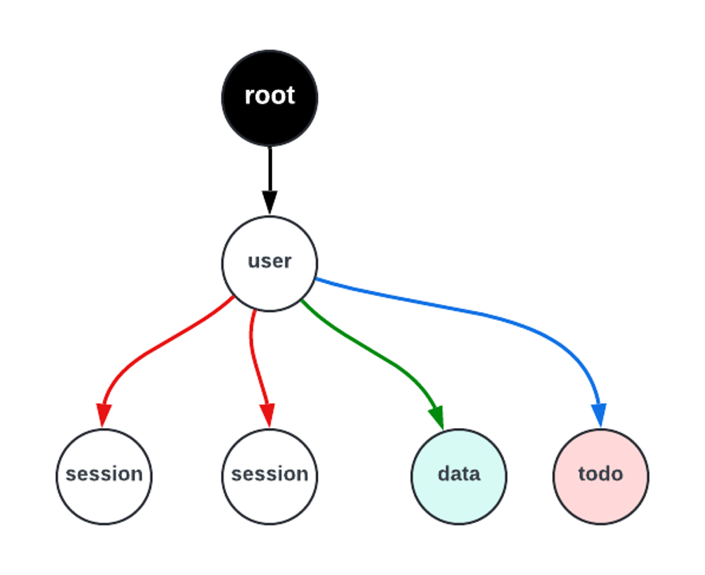
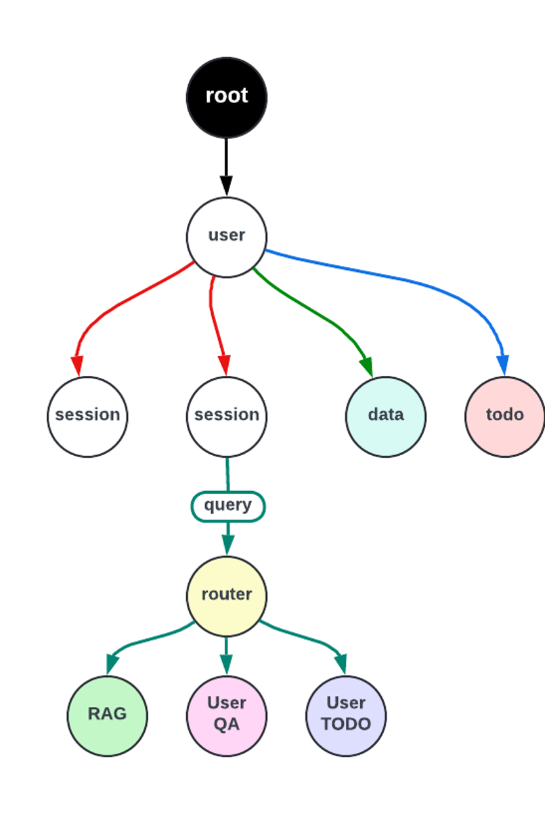

# Assignment Series - AI Lecture Series

In this multi-part assignment series we will be developing a chatbot which is capable of generating domain specific as well as user specific responses.

## Problem Definition

The status quo chatbots in the current market use Large Language Models to answer user queries. However, LLMs seems to hallucinate and misinterpret information due to less context awareness and the lack of recent information about the topic. This has become a problem for many chatbots which are purposefully built to answer domain specific queries.

## Final Goal

The final goal of this assignment is to build a chatbot which can use available specific information and user data to answer queries much accurately, in jaclang. For these assignments, assume there is only user quarrying about health and medical questions.

- A chat-bot that uses three different techniques when answering health related queries.
  1. Use Retrieval Augmented Generation with a repository of expert articles on health and medicine.
  2. Use user-data to generate a more personalized answer.
  3. Give recommendations based on the medical To-do data of the patient.

The query from the user should be routed to its specific type based upon the context offered in the query.

## Assignment 1 - Preface

The data spatial implementation of the chatbot skeleton is expected to view as below.



### Graph Overview:

  #### Nodes & Edges:

- **user:** This chatbot supports multiple users. Each user has their own user node. Let’s consider single user for this assignment.

- **session:** This chatbot supports back-and-forth conversation. The chat history is managed in sessions. So each user might have many sessions. Each session represents one conversation between that user and the chatbot.

- **data:** A node that contains user's health data. It is a user specific data.

- **todo:** Similar to data node. This node contains another type of user specific data - their to-do list.

> **NOTE** :
>   The edges used so far in the graph are generic edges.

#### Walkers:

- **create_graph:** This walker creates the graph excluding session nodes.

- **chat:** This walker creates the session node while gathering all the data and saving to the session node.

## Assignment 1 - Task

Build a ‘query’ walker which activates (spawns) on a session node.



The walker should:
- Build the sub-graph shown in the diagram.

### Graph Overview
- **router :** gets a specific user input from user (‘RAG’, ‘QA’,’TODO’) and direct the walker to the correct functional node.

- **RAG :** This node will be implemented in coming weeks of the assignment. For now, when the query walker enters this node, it should print "I am RAG".

- **User_QA :** This node will be implemented in coming weeks of the assignment. For now, when the query walker enters this node, it should print "I will respond using user data." and the ```user_data``` gathered in the session node.

- **TODO nodes :** This node will be implemented in coming weeks of the assignment. For now, when the query walker enters this node, it should print "I will respond using user to-do list." and the ```todo``` gathered in the session node.
