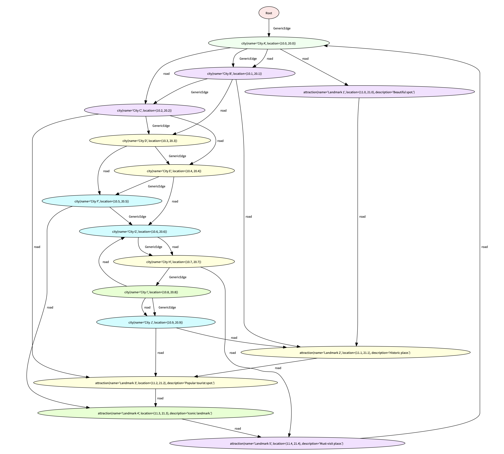

# Geographic Information System for Travelers Using Data Spatial Programming

Imagine you're on a adventure, exploring new cities, and discovering hidden gems along the way you want to;

    - Locate tourist attractions within a specific distance of a given location.
    - Estimate travel times between different points of interest.
    - Identify restaurants situated within a designated area near a tourist attraction.

## Why we prefer data spatial programming over OOP

When building a GIS system, a common approach might be to use Object-Oriented Programming (OOP). For example, you could create classes to represent cities, landmarks, and roads, and use methods to perform tasks like finding distances or connections between locations.

Here's a quick look at an OOP example for GIS:

```python
class City:
    def __init__(self, id, name, location):
        self.id = id
        self.name = name
        self.location = location  # (latitude, longitude)
        self.connections = []

    def add_connection(self, destination, distance):
        self.connections.append(Road(self, destination, distance))

class Landmark:
    def __init__(self, id, name, location):
        self.id = id
        self.name = name
        self.location = location  # (latitude, longitude)
        self.connections = []

    def add_connection(self, destination, distance):
        self.connections.append(Road(self, destination, distance))

class Road:
    def __init__(self, start, end, distance):
        self.start = start
        self.end = end
        self.distance = distance

def find_connections(entity):
    return [(road.end.name, road.distance) for road in entity.connections]

# Example of setting up the GIS network
cities = {
    'A': City(1, "City A", (10.0, 20.0)),
    'B': City(2, "City B", (10.1, 20.1)),
    'C': City(3, "City C", (10.2, 20.2)),
    'D': City(4, "City D", (10.3, 20.3)),
    'E': City(5, "City E", (10.4, 20.4)),
    'F': City(6, "City F", (10.5, 20.5)),
    'G': City(7, "City G", (10.6, 20.6)),
    'H': City(8, "City H", (10.7, 20.7)),
    'I': City(9, "City I", (10.8, 20.8)),
    'J': City(10, "City J", (10.9, 20.9))
}

landmarks = {
    '1': Landmark(1, "Landmark 1", (11.0, 21.0)),
    '2': Landmark(2, "Landmark 2", (11.1, 21.1)),
    '3': Landmark(3, "Landmark 3", (11.2, 21.2)),
    '4': Landmark(4, "Landmark 4", (11.3, 21.3)),
    '5': Landmark(5, "Landmark 5", (11.4, 21.4))
}

# Define connections as per the graph
cities['A'].add_connection(cities['B'], 15)
cities['A'].add_connection(cities['C'], 20)
cities['A'].add_connection(landmarks['1'], 10)

cities['B'].add_connection(cities['D'], 25)
cities['B'].add_connection(landmarks['2'], 30)

cities['C'].add_connection(cities['E'], 35)
cities['C'].add_connection(landmarks['3'], 20)

cities['D'].add_connection(cities['F'], 40)
cities['E'].add_connection(cities['G'], 45)

cities['F'].add_connection(landmarks['4'], 50)
cities['G'].add_connection(cities['H'], 55)
cities['H'].add_connection(landmarks['5'], 60)

cities['I'].add_connection(cities['J'], 10)
cities['I'].add_connection(cities['G'], 70)

cities['J'].add_connection(landmarks['2'], 25)
cities['J'].add_connection(landmarks['3'], 30)

landmarks['1'].add_connection(landmarks['2'], 5)
landmarks['2'].add_connection(landmarks['3'], 15)
landmarks['3'].add_connection(landmarks['4'], 20)
landmarks['4'].add_connection(landmarks['5'], 25)
landmarks['5'].add_connection(cities['A'], 40)

# Example usage: Finding connections for City A
connections = find_connections(cities['A'])
print(f"Connections for {cities['A'].name}: {connections}")
```

Imagine having to manually calculate distances and perform spatial operations to find tourist attractions and restaurants. Initially, this may seem feasible. However, as the number of locations increases, the process becomes complex and inefficient.

This is where spatial programming comes into play. By utilizing this concept, managing and querying large sets of geographical data becomes efficient, making it perfect for travel-oriented systems. Specifically, in a GIS designed for travelers, where the system can provide detailed information about tourist spots, restaurants, and other points of interest.

By using a graph-based structure with nodes representing cities and landmarks, edges representing roads or paths, and walkers as agents that traverse the graph, the system can efficiently perform tasks and provide the user with real-time, accurate travel information.

Representing the problem as a graph using nodes and edges, leveraging the spatial programming features of Jaclang, allows us to perform spatial operations in a more intuitive way. A graphical representation is both expressive and easy to understand, making it ideal for visualizing and solving complex computational problems.

While some argue that traditional programming languages already offer graph libraries, I believe that most programming languages are not optimized to fully utilize the advantages and rich semantics that graphs provide due to being built around specific design abstractions that do not natively include graph structures.

By using a language like Jaclang, which inherently understands and optimizes graph-based data structures, we can take full advantage of these powerful spatial representations, allowing for more efficient and effective solutions to travel-related queries and problems.

### Graph representation of the problem

To represent the above scenario, we can use a graph to show connections between cities and their attractions as mentioned above. The graph's cities and attractions are nodes, and the edges connecting them show the distances between them.

> NOTE:
> + Nodes: Geographic features like cities, tourist attractions, restaurants, and landmarks will be represented as nodes.
> + Edges: Represent spatial relationships or connections between these nodes, such as roads, paths, or distance metrics.

Now let's make some general nodes about cities and landmarks; The `city` node is to represent cities. Each `city` node has two attributes: `name` and `location`.

```jac
node city{
    has name;
    has location;
}

```
The `attraction` represent landmarks or points of interest within or near the cities. Each attraction node has three attributes: `name`, `location` and `description`.

```
node attraction{
    has name;
    has location;
    has description;
}
```

lets create the distance edge; `edge` keyword creates edges, the edge `road` represent the roads connecting the cities and landmarks. Each road has a single attribute: `distance`.

```jac
edge road{
    has distance;
}
```

> NOTE:
> + Walkers: Walkers are agents that traverse the graph to perform specific tasks. In spatial programming in jaclang, walkers can be used to execute spatial queries and operations.

The structure of the graph can create as follows; The `creator` walker is responsible for creating the graph. Inside the create method of the walker:

- **Cities**: Ten city nodes (`city_a` to `city_j`) are created with unique names and locations.
- **Landmarks**: Five attraction nodes (`landmark_1` to `landmark_5`) are created, each with a unique name, location, and description.
- **Roads**: Roads (edges) are established between various city and landmark nodes to form a network. For example:
`city_a` is connected to `city_b` with a road of distance 15 units. `city_a` is also connected to `city_c` and `landmark_1` with roads of distances 20 and 10 units, respectively. The connections are made using the syntax `city_a +: road(distance=15) :+> city_b;`, which creates a road edge between `city_a` and `city_b` with a specified distance.

```
with entry {
    print("Welcome to City Traffic!");

    cities = [];
    for i in range(10){
        city_name = f"City {chr(65 + i)}";
        location = (10.0 + i * 0.1, 20.0 + i * 0.1);
        cities.append(city(name=city_name, location=location));
    }

    end=root;
    end++>(end:=[cities[0]]);

    # Create landmarks
    landmark_1 = attraction(name="Landmark 1", location=(11.0, 21.0), description="Beautiful spot.");
    landmark_2 = attraction(name="Landmark 2", location=(11.1, 21.1), description="Historic place.");
    landmark_3 = attraction(name="Landmark 3", location=(11.2, 21.2), description="Popular tourist spot.");
    landmark_4 = attraction(name="Landmark 4", location=(11.3, 21.3), description="Iconic landmark.");
    landmark_5 = attraction(name="Landmark 5", location=(11.4, 21.4), description="Must-visit place.");

    landmarks = [landmark_1, landmark_2, landmark_3, landmark_4, landmark_5];

    # Create roads between cities and landmarks
    cities[0] +: road(distance=15) :+> cities[1];
    cities[0] <+: road(distance=20) :+> cities[2];
    cities[0] <+: road(distance=10) :+> landmark_1;

    cities[1] <+: road(distance=25) :+> cities[3];
    cities[1] <+: road(distance=30) :+> landmark_2;
    landmark_2 <+: road(distance=40) :+> cities[0];

    cities[2] <+: road(distance=35) :+> cities[4];
    cities[2] <+: road(distance=20) :+> landmark_3;

    cities[3] <+: road(distance=40) :+> cities[5];
    cities[4] <+: road(distance=45) :+> cities[6];

    cities[5] <+: road(distance=50) :+> landmark_4;
    cities[6] <+: road(distance=55) :+> cities[7];
    cities[7] <+: road(distance=60) :+> landmark_5;

    cities[8] <+: road(distance=10) :+> cities[9];
    cities[8] <+: road(distance=70) :+> cities[6];

    cities[9] <+: road(distance=25) :+> landmark_2;
    cities[9] <+: road(distance=30) :+> landmark_3;

    landmark_5 <+: road(distance=40) :+> cities[0];
}
```

### View Graph on Jac Streamlit

To visualize the graph of in Jac streamlit, you can use the following command:

```shell
jac dot_view app.jac
```
This will open up a Streamlit app in your browser, displaying the graph as following figure.

To view the graph in .dot format, you can also use the `jac dot app.jac` command to generate a `.dot` file. Use the Graphviz extension in VS Code to visualize the graph.




## Practical Example Use of the graph

Now that we have created the structure of the problem and have the basics, in the following section we will few practical examples;

Imagine you're in "City A" and you want to find all the cities and landmarks you can visit from there. You can use the following code snippet in Jaclang:

```
visitable = [cities[0]-->];
print(visitable);
print([x.name for x in visitable]);
```

*Explanation*:

* `cities[0]` refers to City A (assuming it is stored in the first index of the cities list).
* `-->` operator is used to find all nodes (cities or landmarks) that are directly reachable from "City A". If you want to filter out only reachable landmarks, change the code to `[cities[0]-->landmarks]`.
* The result shows all destinations accessible from "City A" and their names.

Suppose you want to know all the landmarks you can visit starting from "City J". We can do it as follows;

```
print([i.distance for i in (:e:[cities[9] --> landmarks])]);
```

*Explanation*:
* `cities[9]` refers to City J.
* `:e:` is used to indicate an edge (a road or connection) between nodes.
* `[cities[9] --> landmarks]` retrieves all landmarks directly reachable from City J.
* The result shows the distances to all landmarks that can be visited from City J.


If you want to know how long it takes to get from "City B" to Landmark 2, it is simple as this:

```
print([i.distance for i in (:e:[cities[1] --> landmark_2])]);
```

*Explanation*:
* `cities[1]` represents City B.
* `:e:[cities[1] --> landmark_2]` retrieves the distance along the edge (road) connecting City B and Landmark 2.
* The result provides the exact distance from City B to Landmark 2.


> Notes:
> The `:e:` prefix in Jaclang is used to specify an edge between nodes, allowing you to explore connections and distances between different points in the graph.


If you wanna know which cities you can visit after visiting landmark 2 you can do the following, output will show you which cities possible to visit;

```
print([landmark_2-->cities]);
```

Unlike traditional programming paradigms, Jaclang is designed to handle spatial data naturally, using graphs to represent real-world relationships.
This approach makes it easier to create dynamic, scalable, and efficient GIS solutions tailored for travel enthusiasts like you!

If you’re excited about building your own GIS for travelers, try Jaclang! Whether you’re a developer, data scientist, or just a curious traveler, Jaclang makes it fun and engaging to create intelligent, spatially aware applications.


