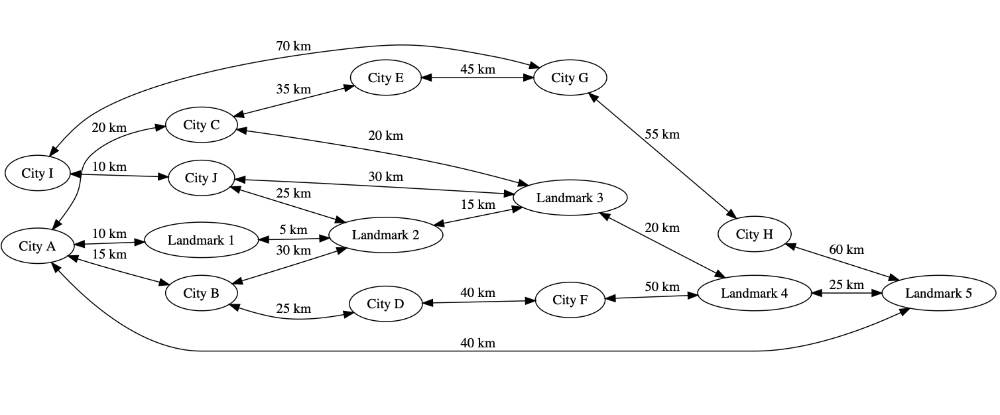

# Geographic Information System for Travelers Using Data Spatial Programming

In this example, we are developing a Geographic Information System designed for travelers. The system will be capable of handling tasks such as:

    - Locating tourist attractions within a specific distance of a given location.
    - Estimating travel times between different points of interest.
    - Identifying restaurants situated within a designated area near a tourist attraction.

## Why we prefer data spatial programming over OOP

In an object-oriented programming approach, each feature can be represented with a class, and operations can be performed using custom methods. For example:

```python
class Attraction:
    def __init__(self, id, name, location, category):
        self.id = id
        self.name = name
        self.location = location  # (latitude, longitude)
        self.category = category

class Restaurant:
    def __init__(self, id, name, location, cuisine_type):
        self.id = id
        self.name = name
        self.location = location  # (latitude, longitude)
        self.cuisine_type = cuisine_type

# Example usage
attractions = [Attraction(1, "Museum", (40.7128, -74.0060), "Museum"), ...]
restaurants = [Restaurant(1, "Italian Bistro", (40.7138, -74.0050), "Italian"), ...]

# Finding attractions within a certain distance from a location
def find_attractions_nearby(location, distance):
    nearby_attractions = []
    for attraction in attractions:
        if calculate_distance(location, attraction.location) <= distance:
            nearby_attractions.append(attraction)
    return nearby_attractions

```

In this approach, you would manually implement distance calculations and other spatial operations. As the dataset grows, this can become complex and less efficient. However, implementing this system using concepts like nodes, edges, and walkers improves the management and querying of geographical data, especially for a travel-focused system. Picture a GIS system designed to assist travelers by providing information about tourist attractions, restaurants, and other points of interest. The system needs to efficiently handle queries such as finding nearby attractions, calculating travel times, and identifying points within certain areas.

In a spatial programming approach, the data is represented as a graph with nodes and edges, and spatial operations are performed using these structures. Here's how this approach compares to an OOP approach in handling the given tasks.

### Nodes, Edges, Walkers and Abilities and Ect in Jaclang

 + Nodes: Represent geographic features like cities, tourist attractions, restaurants, and landmarks.
 + Edges: Represent spatial relationships or connections between these nodes, such as roads, paths, or distance metrics.
 + Walkers: are agents that traverse the graph to perform specific tasks. In spatial programming in jaclang, walkers can be used to execute spatial queries and operations.
 + Abilities: Nodes, edges, and walkers can have abilities. Abilities are most closely analogous to methods in a traditional object oriented program, however they do not have the same semantics of a traditional function. An ability can only interact within the scope of context and local variables of the node/edge/walker for which it is affixed and do not have a return semantic.
 + Visit:
 + Revisit:
 + Disengage:
 + Ignore:


Let's look at the following example;



In the above example nodes represent cities and landmarks, while the edges represent the distance between them.